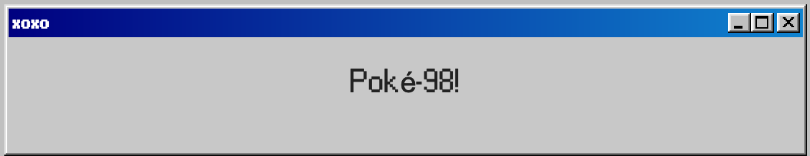

## Poke-98

This is a create-react-app that utilizes state and multiple API calls to display the original 151 pokemon in a 90s style manner.

## Technologies

### 98.css

CSS library for "building faithful recreations of old UIs": https://jdan.github.io/98.css/

### Styled Components

Visual primitives for the component age: https://styled-components.com/

### Redux

A predictable state container for JS apps: https://redux.js.org/

### PokeAPI

All the Pokémon data you'll ever need in one place,
easily accessible through a modern RESTful API: https://pokeapi.co/

-Thanks to [glweems](https://github.com/glweems/) for helping with the backend.
